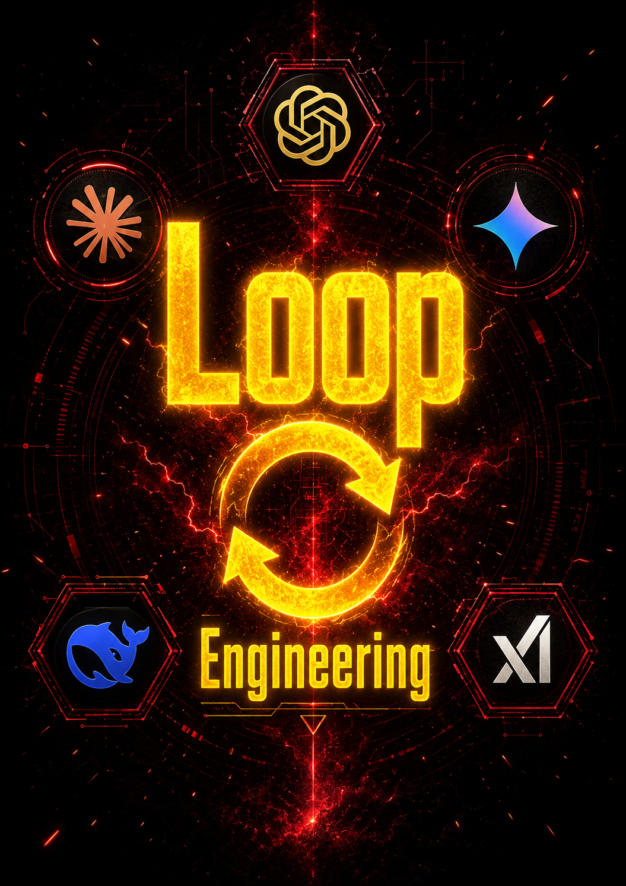
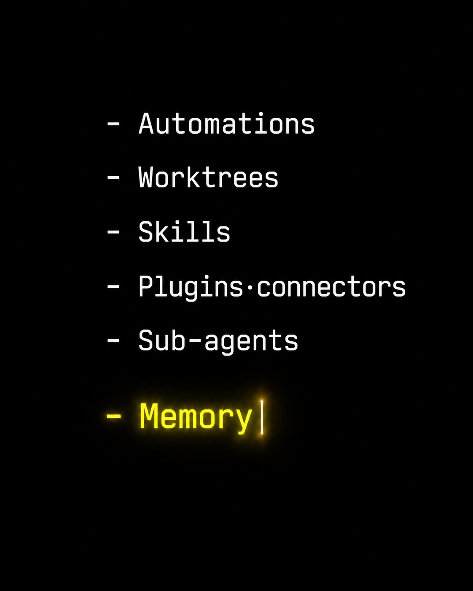

# Loop

<p align="center">
  <a href="https://github.com/rlaope/loop">
    
  </a>
  <a href="https://github.com/rlaope/loop/stargazers">
    
  </a>
  <a href="https://github.com/rlaope/loop/actions/workflows/ci.yml">
    
  </a>
  <a href="https://github.com/rlaope/loop/blob/main/LICENSE">
    
  </a>
  <a href="#quickstart">
    
  </a>
  <a href="https://x.com/rlaope">
    
  </a>
  = 20">
</p>



<div align="center">
  <p><strong>Recursive goals for coding agents that need memory, budgets, and stopping rules.</strong></p>
  <p>Loop is a safety-first Loop Engineering toolkit for coding agents.</p>
  <p>
    Instead of prompting an agent every turn, define a purpose and let the loop
    drive the agent through intake, planning, discovery, isolation, action,
    verification, memory, and stopping rules.
  </p>
  <p>
    The MVP proves the shared core and Codex <code>$loop</code> adapter first.
    Claude Code <code>/loop</code>, connectors, scheduled write automation,
    and marketplace distribution are roadmap work after the core contract is
    stable.
  </p>
  <p>
    Built by <a href="https://github.com/rlaope">@rlaope</a> ·
    <a href="https://rlaope.github.io/artengine-lab/">Art & Engineering</a>
  </p>
</div>

## Loop Engineering Components



Loop is built around six working components:

- Automations: repeatable read-only discovery, triage, and scheduled checks.
- Worktrees: isolated branches or directories for code-changing work.
- Skills: durable workflow instructions such as `$loop`.
- Plugins/connectors: distribution and optional external context surfaces.
- Sub-agents: delegated maker/checker or specialist lanes.
- Memory: markdown, JSON state, or issue boards that survive one chat session.

## What Ships In The MVP

- Durable local memory in `.loop/runs/*.json`, `.loop/runs/*.md`, and
  `.loop/latest-runs.json`.
- Loop Wiki second-brain storage in `.loop/wiki/user/*.md`,
  `.loop/wiki/ai/*.json`, `.loop/wiki/index.json`, and
  `.loop/wiki/graph.json`.
- A shared run-state schema with objective, phase, budget, stop condition,
  verification evidence, approval state, and next action.
- Budget and stop-condition helpers for bounded agent loops.
- Repo-boundary and isolation preflight helpers for code-changing work.
- A Codex plugin manifest and `$loop` skill.
- A dry-run CLI path that writes state without changing source files.
- A `loop run` command that can hand an objective to Codex or Claude Code after
  agent selection and optional goal clarification.
- `loop wiki` commands for listing, reading, opening, and serving local
  human-readable run notes.

## Quickstart

Install Loop once:

```sh
npm install -g github:rlaope/loop
loop --version
```

Create or enter the project you want the coding agent to work on:

```sh
mkdir darkwear-exhibit
cd darkwear-exhibit
git init -b main
loop run "Build a darkwear luxury exhibition site"
```

`loop run "prompt"` opens an agent picker for the prototype:

- `codex`
- `claudecode`

You can skip the picker by passing the agent explicitly:

```sh
loop run --agent codex "Build a darkwear luxury exhibition site"
loop run --agent claudecode "Build a darkwear luxury exhibition site"
```

If you want to try Loop without installing it first:

```sh
npm exec --yes --package github:rlaope/loop -- loop run "Build a darkwear luxury exhibition site"
```

If Loop says the git root does not match, you are probably inside a parent git
repository. Run `git init -b main` in the intended project folder, or run Loop
from the parent repo root if that is the repository you want the agent to edit.

If the prompt is too ambiguous for a loop, the CLI asks a short deep-interview
style set of questions in the terminal, closes the interview, records the
clarified objective, and then starts the selected coding agent.

Dry-run mode is still available when you only want durable state and a wiki
note without source edits:

```sh
loop --dry-run --objective "Build a darkwear luxury exhibition site"
```

Read the generated second-brain notes locally:

```sh
loop wiki list
loop wiki read <note-id>
loop wiki open <note-id>
loop wiki
```

`loop wiki` starts a localhost-only dashboard for `.loop/wiki`. The markdown
note under `.loop/wiki/user` is canonical; AI memory, index, and graph files are
derived from it. `loop run` does not start the dashboard in non-interactive
automation unless `--wiki-dashboard` is passed. Most users can ignore that flag
and open the dashboard later with `loop wiki`.

To verify the package:

```sh
npm install
npm test
npm run lint
npm run typecheck
```

After the package is published to npm, the shorter registry form will be:

```sh
npx @rlaope/loop run "Build a darkwear luxury exhibition site"
npx @rlaope/loop --dry-run --objective "Build a darkwear luxury exhibition site"
npm install -g @rlaope/loop
```

## Codex Usage

Install or load this repository as a Codex plugin source, then invoke:

```text
$loop <objective>
```

The skill tells the agent to record durable state, check repository boundaries,
choose an isolation mode, enforce budgets, and keep maker/checker separation.

## Safety Defaults

Loop is not an excuse to stop engineering. It is a way to make agent repetition
observable and bounded.

- Every loop needs a budget and stop condition before work starts.
- Code-changing loops need a worktree, branch, or explicit local-mode
  acknowledgement.
- MVP automations are read-only or triage-only unless durable human approval
  exists.
- Passing tests are evidence, not proof that the human no longer owns the
  result.

## Docs

- [Loop Engineering concept](docs/loop-engineering.md)
- [Compatibility matrix](docs/compatibility.md)
- [Safety model](docs/safety.md)
- [Issue-to-commit map](docs/issues.md)
- [Roadmap](docs/roadmap.md)
- [Dry-run maintenance example](examples/dry-run-maintenance.md)

## Development

```sh
npm install
npm test
npm run lint
npm run typecheck
```

Build the loop, stay the engineer.
